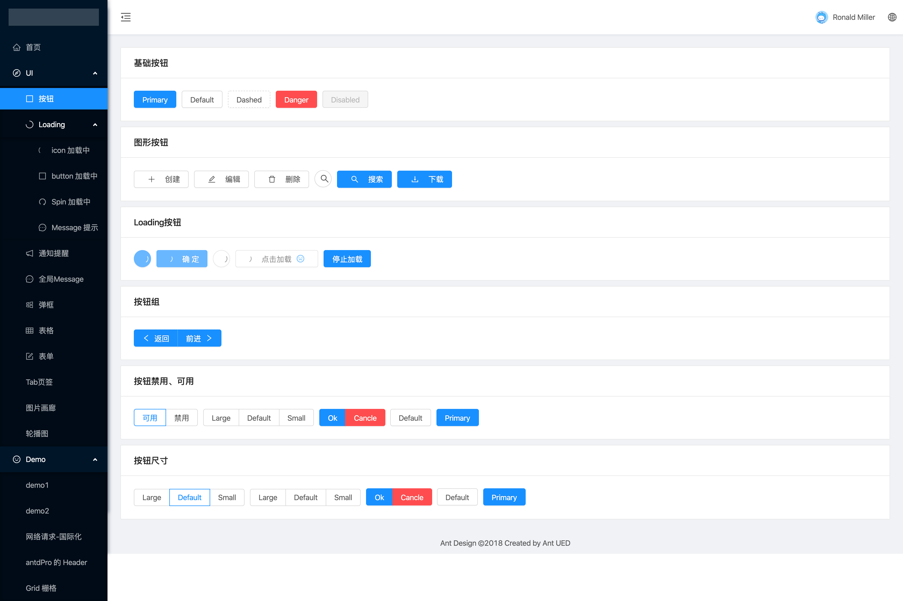

> 项目进度和计划情况需要查看 issue 区。

# 项目依赖指南

> 最新的在顶部

- ui 库 antd

  ```
  $ yarn add antd
  ```

- 高级配置

  > 不在 eject 的前提下修改 cra 默认配置

  ```
  $ yarn add react-app-rewired customize-cra
  $ yarn add babel-plugin-import
  ```

  > 按照 antd 官方的配置指南做的配置,可以参考一下链接
  > 高级配置 [高级配置](https://ant.design/docs/react/use-with-create-react-app-cn#%E9%AB%98%E7%BA%A7%E9%85%8D%E7%BD%AE)

- 路由

  ```
  $ yarn add react-router-dom
  ```

  > react-router 官网 [react-router](https://reacttraining.com/react-router/web/guides/quick-start)

- 状态管理器

  ```
  yarn add redux react-redux redux-thunk
  ```

# 可用脚本

1. 开发

   ```
   yarn start // npm run start
   ```

2. 生产编译

   ```
   yarn run build // npm run build
   ```

# 效果图


